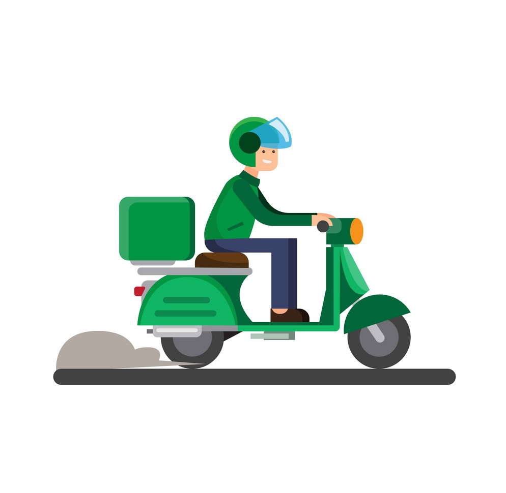
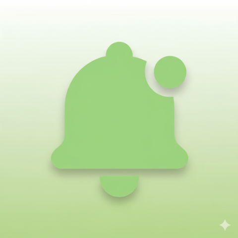
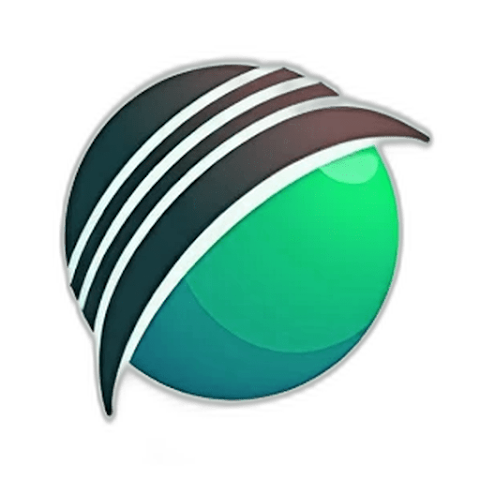

  

  

 

  
  &nbsp;
  

 

 

### What I do

**Mobile apps, built properly.** I work with Flutter to ship production Android and iOS apps. Not just prototypes — apps with real state management, offline sync, animations and platform integrations.

**Backend, infrastructure and the bits in between.** Node.js APIs over REST and GraphQL, deployed on VPS with nginx, SSL and proper process management. Real-time features via WebSockets, job queues, and third-party integrations done right.

**Complete systems, not just parts.** I build full SaaS products and IoT-enabled platforms where every layer talks to each other cleanly — mobile client, server, database, hardware. I take things from zero to live.

 

 

### Some of my Client's Apps

These are some of my <strong>published products</strong> I have built for <strong>companies and client teams</strong>. They are <strong>not my own startups or personal apps</strong>. I have worked on many more production systems, but I can only share a selected set here because <strong>several projects are covered by NDA</strong>.

<table width="100%" cellpadding="12">
  <tr>
    <td width="100" valign="middle" align="center">
      
    </td>
    <td valign="top">
      <strong>CouCou Express</strong> 
      <strong>Built for CouCou</strong> 
       
       
      <strong>All-in-one delivery platform</strong> for food, parcels, groceries, pharmacies, supershops, and more, <strong>currently serving users in Senegal</strong>.  
      
       
      <strong>Tech:</strong> Flutter, Node.js, MongoDB, WebSockets 
      <strong>Highlight:</strong> Real-time order flow and multi-service delivery operations
    </td>
  </tr>
</table>

<table width="100%" cellpadding="12">
  <tr>
    <td width="100" valign="middle" align="center">
      
    </td>
    <td valign="top">
      <strong>CouCou Express Driver</strong> 
      <strong>Built for CouCou</strong> 
      
       
      <strong>Driver and rider operations app</strong> with dispatch, <strong>GPS-based order assignment</strong>, live tracking, status updates, earnings, and customer communication.  
      
       
      <strong>Tech:</strong> Flutter, Node.js, MongoDB, Geofencing, WebSockets 
      <strong>Highlight:</strong> Live rider tracking and operational dispatch workflows
    </td>
  </tr>
</table>

<table width="100%" cellpadding="12">
  <tr>
    <td width="100" valign="middle" align="center">
      
    </td>
    <td valign="top">
      <strong>ServiceHub NZ</strong> 
      <strong>Built for KiaSolutions</strong> 
       
       
      <strong>Service marketplace + business SaaS + CRM</strong> for the New Zealand market, with <strong>40+ features</strong> across operations, scheduling, customer management, and business workflows.  
      
       
      <strong>Tech:</strong> Flutter, Node.js, MongoDB, Microservices, OAuth 
      <strong>Highlight:</strong> Integrated platform architecture with geolocation-powered workflows
    </td>
  </tr>
</table>

<table width="100%" cellpadding="12">
  <tr>
    <td width="100" valign="middle" align="center">
      
    </td>
    <td valign="top">
      <strong>ServiceHub Staff</strong> 
      <strong>Built for KiaSolutions</strong> 
       
       
      <strong>Workforce management app</strong> covering payroll, leave, expenses, attendance, <strong>live location monitoring</strong>, and core HRM operations.  
      
       
      <strong>Tech:</strong> Flutter, Node.js, MongoDB, GPS Tracking, Role-based Access 
      <strong>Highlight:</strong> HR workflows connected with real-time field visibility
    </td>
  </tr>
</table>

<table width="100%" cellpadding="12">
  <tr>
    <td width="100" valign="middle" align="center">
      
    </td>
    <td valign="top">
      <strong>Notifa</strong> 
      <strong>Built for Prevail IT</strong> 
       
       
      <strong>Never forget what matters.</strong> A smart reminder system that <strong>breaks through Google Cloud Scheduler's 30-day barrier</strong> with an intelligent layered queue architecture, enabling <strong>reliable notifications up to one year in advance</strong>.  
      
       
      <strong>Tech:</strong> Flutter, Firebase, Google Cloud Scheduler, Cloud Functions 
      <strong>Highlight:</strong> Two-level database-driven scheduling for long-range reminders
    </td>
  </tr>
</table>

<table width="100%" cellpadding="12">
  <tr>
    <td width="100" valign="middle" align="center">
      
    </td>
    <td valign="top">
      <strong>TipsWe</strong> 
      <strong>Built for Zemparant LLC</strong> 
       
       
      <strong>Sports analytics and prediction platform</strong> delivering prediction content, actionable insights, and <strong>live sports score experiences</strong>.  
      
       
      <strong>Tech:</strong> Flutter, Firebase, REST APIs, Cloud Functions 
      <strong>Highlight:</strong> Analytics-driven sports content with real-time score delivery
    </td>
  </tr>
</table>

<table width="100%" cellpadding="12">
  <tr>
    <td width="100" valign="middle" align="center">
      
    </td>
    <td valign="top">
      <strong>CricOn</strong> 
      <strong>Built for a sports-tech client</strong> 
       
       
      <strong>Real-time cricket scoring engine</strong> with ball-by-ball updates, <strong>automatic rate calculations</strong>, match-state handling, and tournament standings generation.  
       
      <strong>Tech:</strong> Flutter, Firebase, Realtime Database, Scoring Logic 
      <strong>Highlight:</strong> Computation-heavy live scoring and leaderboard pipelines
    </td>
  </tr>
</table>

 

 

  <h3>Stack</h3>
  

 

 

  <h3>GitHub</h3>
  
  
    
  

 

 

  <h3>Codeforces</h3>
  

 

 

  <h3>Connect</h3>
  
  &nbsp;
  
  &nbsp;
  
  &nbsp;
  

 

  

